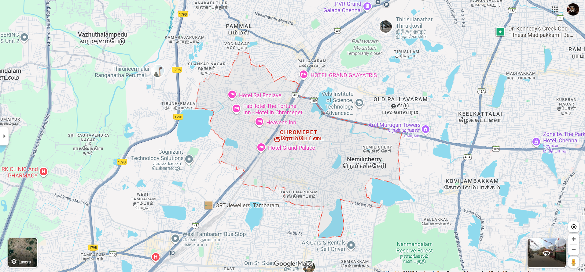

# Ex04 Places Around Me
## Date:23.06.2025

## AIM
To develop a website to display details about the places around my house.

## DESIGN STEPS

### STEP 1
Create a Django admin interface.

### STEP 2
Download your city map from Google.

### STEP 3
Using ```<map>``` tag name the map.

### STEP 4
Create clickable regions in the image using ```<area>``` tag.

### STEP 5
Write HTML programs for all the regions identified.

### STEP 6
Execute the programs and publish them.

## CODE
```
park.html
<!DOCTYPE html>
<html lang="en">
<head>
    <meta charset="UTF-8">
    <meta name="viewport" content="width=device-width, initial-scale=1.0">
    <title>PARK</title>
</head>
<body>
    A park is a green and open space where people of all ages can enjoy and relax. It is usually filled with trees, plants, flowers, and walking paths that make the surroundings refreshing. Children love to play on swings, slides, and open grounds, while elders enjoy morning walks and yoga. Parks are also important for maintaining a healthy environment, as they provide fresh air and reduce pollution. Families often visit parks during evenings or weekends to spend time together and connect with nature. Thus, a park is both a recreational spot and a natural gift to society.
</body>
</html>

saravanastore.html
<!DOCTYPE html>
<html lang="en">
<head>
    <meta charset="UTF-8">
    <meta name="viewport" content="width=device-width, initial-scale=1.0">
    <title>SARAVANASTORE</title>
</head>
<body>
    Saravana Store is one of the most popular shopping centers in Tamil Nadu, especially in Chennai. It is well known for offering a wide variety of products under one roof, such as clothes, jewelry, household items, and electronics. People are attracted to Saravana Store because of its affordable prices and countless options for every need. It is always crowded with customers, particularly during festive seasons when shopping is at its peak. Many people prefer Saravana Store because it saves time and money by providing everything in a single place. It is not just a shop, but a well-known shopping experience for thousands of families.
</body>
</html>

temple.html
<!DOCTYPE html>
<html lang="en">
<head>
    <meta charset="UTF-8">
    <meta name="viewport" content="width=device-width, initial-scale=1.0">
    <title>TEMPLE</title>
</head>
<body>
    A temple is a holy place where people go to worship and seek blessings. It is often built with beautiful architecture, sculptures, and carvings that represent culture and tradition. The atmosphere inside a temple is peaceful and filled with the sound of bells, chants, and prayers. People visit temples not only to pray but also to find inner peace and strength. Many festivals and special occasions are celebrated in temples with devotion, and this helps in bringing communities together. A temple is therefore not just a place of worship, but also a symbol of faith and unity.
</body>
</html>

home.html
<!-- Image Map Generated by http://www.image-map.net/ -->


<map name="image-map">
    <area target="" alt="temple" title="temple" href="temple.html" coords="840,311,1065,432" shape="rect">
    <area target="" alt="sravana store" title="sravana store" href="sravanastore.html" coords="1141,564,116" shape="circle">
    <area target="" alt="park" title="park" href="park.html" coords="572,276,660,269,749,311,737,402,640,429,530,408,516,328" shape="poly">
</map>
```


## OUTPUT





## RESULT
The program for implementing image maps using HTML is executed successfully.
